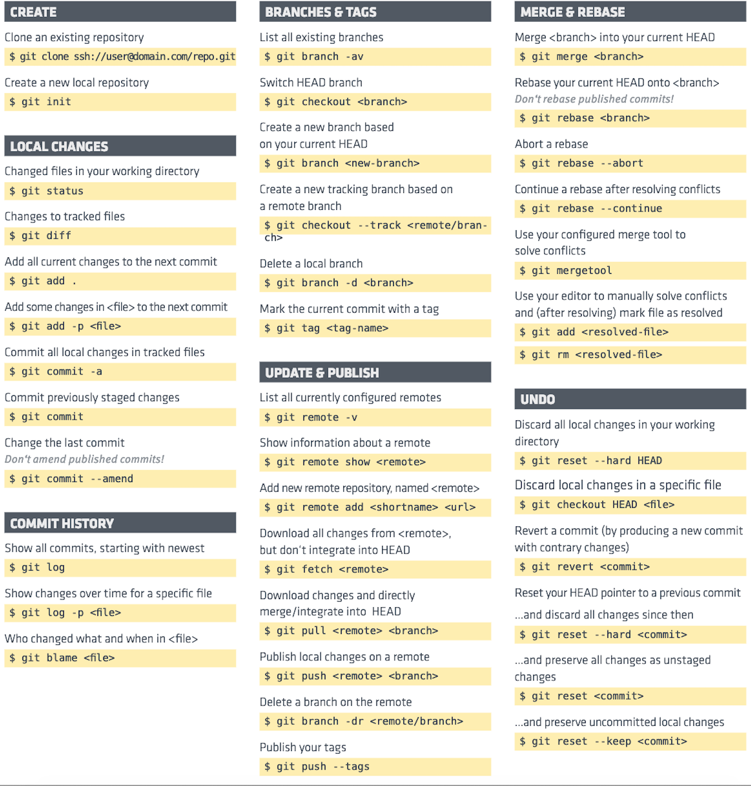

# GIT日记

  

参考文档:  
[廖雪峰git教程](https://www.liaoxuefeng.com/wiki/0013739516305929606dd18361248578c67b8067c8c017b000)  
[官方git中文教程](https://git-scm.com/book/zh/v2)  

## 安装Git  

* 在linux上安装git  
  首先,你可以试着输入`git`,看看系统有没有安装git:  
  ```
  $ git  
  the program 'git' is currently not installed. you can install it by typing:  
  sudo apt-get install git  
  ```  
* 在mac os x上安装git    
  如果你正在使用mac做开发,有两种安装git的方法.  
  一是安装homebrew,然后通过homebrew安装git,具体方法参考homebrew的文档:[http://brew.sh/](http://brew.sh/)  
  第二种方法更简单.也是推荐的方法,就是直接从App Store安装xcode,xcode集成了git.不过没有默认安装.你需要运行xcode.选择菜单"xcode"->"preferences",在弹出的窗口中找到"downloads",  
  选择"command line tools",点"install"就可以完成安装了.  

* 在Windows上安装git  
  在Windows上使用git,可以从git官网直接[下载安装程序](https://git-scm.com/downloads),(网速慢的同学请移步[国内镜像](https://pan.baidu.com/s/1kU5OCOB#list/path=%2Fpub%2Fgit)),  
  然后按默认选项安装即可.  
  安装完成后,在开始菜单里找到"git"->"git bash",蹦出一个类似命令行窗口的东西.就说明git安装成功!  

  安装完成后,还需要最后一步设置,在命令行输入:  
  ```
  $git config --global user.name 'your name'  
  $git config --global user.email 'email@example.com'  

  ```  
  因为git是分布式版本控制系统,所以,每个机器都必须自报家门:你的名字和email地址.  
  注意:`git config`命令的`--global`参数,用了这个参数.表示你这台机器上的所有git仓库都会使用这个配置,当然也可以对某个仓库指定不同的用户名和email地址.  

## 创建版本库  
* 创建版本库  

  什么是版本库?版本库又叫仓库,英文名repository,你可以简单理解成一个目录,这个目录里的所有文件都可以被git管理起来,每个文件的修改,删除,git都能追踪,以便任何时刻都可以追踪历史,  
  或者在将来某个时刻可以"还原".  
  所以,创建一个版本库非常简单,首先,选择一个合适的地方,创建一个空目录:  
  ```
  $ mkdir git  
  $ cd git  
  $ pwd  
  /users/michael/git  
  ```
  `pwd`命令用于显示当前目录.
  **如果你使用Windows系统,为了避免遇到各种莫名其妙的问题,请确保目录名(包括父目录)不包含中文.**  
  第二步,通过`git init`命令把这个目录变成git可以管理的仓库:  
  ```
  $ git init  
  initialized empty git repository in /users/michael/git/.git/  
  ```
  瞬间git就把仓库建好了,而且告诉你是一个空仓库,细心的读者可以发现当前目录下多了一个`.git`的目录,这个目录是git来跟踪管理版本库的,没事千万不要手动修改这个目录里的文件.  
  也不一定必须在空目录下创建git仓库,选择一个已经有东西的目录也是可以的.  

* 把文件添加到版本库  
  我们编写一个`readme.txt`文件,内容如下:  
  ```
  git is a version control system.  
  git is free software.  
  ```
  一定要放到`git`目录下(子目录也行),因为这是一个Git仓库,放到其他地方git再厉害也找不到这个文件.  
  第一步,用命令`git add`告诉git,把文件添加到仓库:  
  ```
  $ git add readme.txt  
  ```
  执行上面的命令,没有任何显示,这就对了,Unix的哲学是"没有消息就是好消息",说明添加成功.  
  第二步,用命令`git commit`告诉git,把文件提交到仓库:  
  ```
  $ git commit -m 'wrote a readme file'  
  [master (root-commit) eaadf4e] wrote a readme file  
   1 file changed,2 insertions(+)  
   create mode 100644 readme.txt  
  ```
  简单解释一下`git commit`命令,`-m`后面输入的是本次提交的说明,可以输入任何内容,当然最好是有意义的,这样你就能从历史记录里方便地找到改动记录.  
  `git commit`命名执行成功后会告诉你,`1 file changed`:1个文件被改动;`2 insertions`:插入了两行内容.  
  **为什么git添加文件需要`add`,`commit`一共两步呢?因为`commit`可以一次提交很多文件,所以你可以多次`add`不同的文件,比如:**  
  ```
  $ git add file1.txt  
  $ git add file2.txt file3.txt  
  $ git commit -m 'add 3 files.'  
  ```
* 小结  
  初始化一个Git仓库,使用`git init`命令.  
  添加文件到git仓库,分两步:  
    1. 使用命令`git add <file>`,注意,可反复多次使用,添加多个文件; 
    2. 使用命令`git commit -m <message>`,完成.  

## 时光机穿梭  
  我们已经成功地添加并提交了一个readme.txt文件,现在,是时候继续工作了,于是,我们继续修改readme.txt文件,改动如下:  
  ```
  git is a distributed version control system.  
  git is free software.  
  ```
  现在,运行`git status`命令看看结果:  
  ```
  $ git status  
  on branch master  
  changes not staged for commit:  
    (use "git add <file>..." to update what will be commited)  
    (use "git checkout -- <file>..." to discard changes in working directory)  
    
      modified:  readme.txt  
  no changes added to commit (use "git ad" and/or 'git commit -a')  
  ```
  `git status`命令可以让我们时刻掌握仓库当前的状态,上面的命令输出告诉我们,`readme.txt`被修改过了,但还没有准备提交的修改.  

  虽然git告诉我们`readme.txt`被修改了,但如果能看看具体修改了什么内容,自然是很好的.比如你休假两周从国外回来,第一天上班时,已经记不清上次怎么修改的`readme.txt`,所以,需要用`git diff`这个命令看看:  
  ```
  $ git diff readme.txt  
  diff --git a/readme.txt b/readme.txt  
  index 46d49bf..9247db6 100644  
  --- a/readme.txt  
  +++ b/readme.txt  
  @@ -1,2 +1,2 @@  
  -git is a version control system.  
  +git is a distributed version control system.  
   git is free software.  
  ```  
  `git diff`顾名思义就是查看difference,显示的格式正是Unix通用的diff格式,可以从上面的命令输出看到,我们在第一行添加了一个`distributed`单词.  
  知道了对`readme.txt`做了什么修改后,再把它提交到仓库就放心多了,提交修改和提交新文件是一样的两步,第一步是`git add`:  

  ```
  $ git add readme.txt  
  ```
  同样没有任何输出.在执行第二步`git commit`之前,我们再运行`git status`看看仓库当前的状态:  
  ```
  $ git status  
  on branch master  
  changes to be committed:  
    (use "git reset head <file>..." to unstage)  

      modified:  readme.txt  
  ```
  `git status`告诉我们,将要被提交的修改包括`readme.txt`,下一步就可以放心的提交了:  
  ```
  $ git commit -m 'add distributed'  
  [master e475afc] add distributed  
   1 file changed, 1 insertion(+), 1 deletion(-)  
  ```
  提交后,我们再用`git status`命令参看仓库当前的状态:  
  ```
  $ git status  
  on branch master  
  nothing to commit,working tree clean  
  ```
  git告诉我们当前没有需要提交的修改,而且,工作目录是干净的.  

### 小结  

  * 要随时掌握工作区的状态,使用`git status`命令.
  * 如果`git status`告诉你有文件被修改过,用`git diff`可以查看修改内容  

## 版本回退  
  现在我们再次修改文件`readme.txt`:  
  ```
  git is distributed version control system.  
  git is free software distributed under the gpl.  
  ```
  然后尝试提交:  
  ```
  $ git add readme.txt  
  $ git commit -m 'append gpl'  
  [master 1094adb] append gpl  
   1 file changed, 1 insertion(+), 1 deletion(-)  
  ```
  像这样,你不断对文件进行修改,然后不断提交修改到版本库里,就好比完RPG游戏时,每通过一关就会自动把游戏状态存盘,如果某一关没过去,你还可以选择读取前一关的状态.git也是一样,  
  每当你觉得文件修改到一定程度的时候,就可以"保存一个快照",这个快照在git中被称为`commit`.一旦你把文件改乱了,或误删了,还可以从最近的一个`commit`恢复,然后继续工作,而不是  
  把几个月的工作成果全部丢失. 

  现在,我们回顾一下`readme.txt`文件一共有几个版本被提交到git仓库里了:  

  版本1: wrote a readme file  
  ```
  git is a version control system.  
  git is free software.  
  ```
  版本2: add distributed  
  ```
  git is a distributed version control system.  
  git is free software.  
  ```
  版本3: append gpl  
  ```
  git is a distributed version control system.  
  git is free software distributed under the gpl.  
  ```
  当然了,在实际工作中,我们脑子里怎么可能记得一个几千行的文本每次都改了什么内容,不然要版本控制系统干什么.版本控制系统肯定有某个命令可以告诉我们历史记录,在git中,我们用`git log`  
  命令查看:  
  ```
  $ git log  
  commit 1094adb7b9b3807259d8cb349e7df1d4d6477073 (HEAD -> master)  
  Author: IAMBANMA <840798591@qq.com>  
  Date:   Fri May 18 21:06:15 2018 +0800  

    append GPL  

  commit e475afc93c209a690c39c13a46716e8fa000c366  
  Author: IAMBANMA <840798591@qq.com>  
  Date:   Fri May 18 21:03:36 2018 +0800  

    add distributed  

  commit eaadf4e385e865d25c48e7ca9c8395c3f7dfaef0  
  Author: IAMBANMA <840798591@qq.com>  
  Date:   Fri May 18 20:59:18 2018 +0800  

     wrote a readme file  
  ```
  `git log`命令显示从最近到最远的提交日志,我们可以看到3次提交,最近一次是`append gpl`,上一次是`add distributed`,最早的一次是`wrote a readme file`.  
  如果嫌输出的信息太多,看得眼花缭乱的,可以加上`--pretty=oneline`参数:  
  ```
  $ git log --pretty=oneline  
  1094adb7b9b3807259d8cb349e7df1d4d6477073 (HEAD -> master) append GPL  
  e475afc93c209a690c39c13a46716e8fa000c366 add distributed  
  eaadf4e385e865d25c48e7ca9c8395c3f7dfaef0 wrote a readme file  
  ```
  好了,现在我们启动时光穿梭机,准备把`readme.txt`回退到上一个版本,也就是`add distributed`的那个版本,怎么做呢?  
  首先,git必须知道当前版本是那个版本,在git中,用`HEAD`表示当前版本,上一个版本就是`HEAD^`,上上一个版本就是`HEAD^^`,当然往上100个版本写100个^是不现实的,所以写成`HEAD~100`.  
  现在,我们要把当前版本`append gpl`回退到上一个版本`add distributed`,就可以使用`git reset`命令:  
  ```
  $ git reset --hard HEAD^  
  HEAD is now at e475afc distributed  
  ```
  看看`readme.txt`的内容是不是版本`add distributed`:  
  ```
  $ cat readme.txt  
  git is a distributed version control system.  
  git is free software.  
  ```
  果然被还原了.  
  还可以继续回退到上一个版本`wrote a readme file`,我们先用`git log`查看下现在版本库的状态,最新的那个版本`append gpl`已经看不到了!  

  现在,你回退到了某个版本,第二天又想回到最新的版本,怎么办呢?  
  在git中,总是有后悔药可以吃的.当你用`$git reset --hard HEAD^`回退到`add distributed`版本时,再想恢复到`append gpl`,就必须找到`append gpl`的commit id.  
  git提供了一个命令`git reflog`用来记录你的每一次命令:  

  ```
  $ git reflog  
  e475afc HEAD@{1}: reset: moving to HEAD^  
  1094adb (HEAD -> master) HEAD@{2}: commit: append GPL  
  e475afc HEAD@{3}: commit: add distributed  
  eaadf4e HEAD@{4}: commit (initial): wrote a readme file  
  ```

### 小结  
  * `HEAD`指向的版本就是当前版本,因此,git允许我们在版本的历史之间穿梭,使用命令`git reset --hard commit_id`.  
  * 穿梭前,用`git log`可以参看提交历史,以便确定回退到那个版本.  
  * 要重返未来,用`git reflog`参看命令历史,以便确定回到未来的那个版本.  

## 工作区和暂存区  
  * 工作区  
    工作区就是你在电脑里能看到的目录,比如我的git文件夹就是一个工作区.  
  * 版本库(repository)  
    工作区有一个隐藏目录`.git`,这个不算工作区,而是git的版本库.  
    git的版本库里存了很多东西,其中最重要的就是称为stage(或者又叫index)的暂存区,还有git为我们自动创建的第一个分支`master`,以及指向`master`的一个指针叫`HEAD`.  
    前面我们把文件往git版本库里添加的时候是分两步执行的:  
      * 第一步使用`git add`把文件添加进去,实际上就是把文件修改添加到暂存区;  
      * 第二步使用`git commit`提交更改,实际上就是把暂存区的所有内容提交到当前分支.  
    因为我们创建git版本库时,git自动为我们创建了唯一一个`master`分支,所以,现在`git commit`就是往`master`分支上提交更改.  

### 小结  
  暂存区是git非常重要的概念,弄明白了暂存区,就弄明白了git的很多操作到底干了什么.  

## 管理修改  
  什么是修改?比如你新增了一行,这是一个修改,删除了一行,也是一个修改,更改了某些字符,也是一个修改,创建了一个新文件,也是一个修改.  
  为什么说git管理修改,而不是文件呢?我们还是做实验.第一步,对readme.txt做一个修改:  
  ```
  git is a distributed version control system.  
  Git is free software distributed under the GPL.  
  Git has a mutable index called stage.  
  Git tracks changes.  
  ```
  然后,添加:  
  ```
  $ git add readme.txt  
  $ git status  
  # On branch master  
  # Changes to be committed:  
  #   (use "git reset HEAD <file>..." to unstage)  
  #
  #       modified:   readme.txt  
  # 
  ```
  然后再修改readme.txt:
  ```
  Git is a distributed version control system.  
  Git is free software distributed under the GPL.  
  Git has a mutable index called stage.  
  Git tracks changes of files.  
  ```
  提交:
  ```
  $ git commit -m "git tracks changes"  
  [master 5463728] git tracks changes  
   1 file changed, 1 insertion(+)  
  ```
  提交后查看状态:  
  ```
  $ git status  
  on branch master  
  changes not staged for commit  
    (use "git add <file>.." to update what will be commited)  
    (use "git checkout -- <file>..." to discard changes in working directory)  

      modified:  readme.txt  

  no changes added to commit (use "git add" and/or "git commit -a")  
  ```
  咦,第二次修改没有被提交?  
  为什么呢?因为第二次修改后没有`git add`,所以不在暂存区,所以没有被提交.  

### 小结  
  每次修改,如果不用`git add`到暂存区,那就不会加入到`commit`中.  

## 撤销修改  
  每次通过`git commit`提交修改后,然后使用`git status`参看仓库状态,git总会有一句提示:
  ```
  (use 'git checkout -- <file>...' to discard changes in working directory)  
  ```
  git告诉你,`git checkout --file`可以丢弃工作区的修改.比如:  
  ```
  $ git checkout --readme.txt  
  ```
  上面命令的意思是吧readme.txt文件在工作区的修改全部撤销,这里有两种情况:  
  * 一种是`readme.txt`自修改后还没有被放到暂存区,现在,撤销修改就回到和版本库一模一样的状态;  
  * 一种是`readme.txt`已经添加到暂存区后,又做了修改,现在,撤销修改就回到添加到暂存区后的状态.  
  总之,就是让这个文件回到最近一次`git commit`或`git add`的状态.  

  `git checkout -- file`命令中的`--`很重要,没有`--`,就变成了"切换到另一个分支"的命令.  

  git同样告诉我们,用命令`git reset  HEAD <file>`可以把暂存区的修改撤销掉,重新放回工作区:  
  ```
  $ git reset HEAD readme.txt  
  unstaged changes after reset:  
  m    redme.txt  
  ```
  `git reset`命令既可以回退版本,也可以把暂存区的修改回退到工作区.  

### 小结  
  * 场景1:当你改乱了工作区某个文件的内容,想直接丢弃工作区的修改,用命令`git checkout -- file`.(`git add`前)  
  * 场景2:当你不但改乱了工作区某个文件的内容,还添加到了暂存区时,想丢弃修改,分两步,第一步用命令`git reset HEAD <file>`,就回到了场景1,第二步按场景1操作.(`git commit`前)  
  * 场景3:已经提交了不合适的修改到版本库时,想撤销本次提交,参考版本回退一节,不过前提是没有推送到远程库(`git commit`后)  

## 删除文件  
  在git中,删除也是一个修改操作,我们先添加一个新文件test.txt到git并提交.  
  一般情况下,你通常直接在文件管理器中把没用的文件删了,或者用`rm`命令删了,这个时候,git知道你删除了文件,因此,工作区和版本库就不一致啦,`git status`命令会立刻告诉你哪些文件被删除了.  
  现在你有两个选择,一是确实要从版本库中删除该文件,那就用命令`git rm`删掉,并且`git commit`.  
  另一种情况是删错了,因为版本库里还有呢,所以很轻松地把误删的文件恢复到最新版本:  
  ```
  $ git checkout -- test.txt  
  ```

### 小结  
  命令`git rm`用于删除一个文件.如果一个文件已经被提交到版本库,那么你永远不用担心误删,但是要小心,你只能恢复文件到最新版本,你回丢失最近一次提交后你修改的内容.  

## 远程仓库  
  现阶段,你只需要注册一个github账号,就可以免费获得git远程仓库.  
  注册好github账号后,由于你的本地git仓库和github仓库之间的传输是通过SSH加密的,所以需要一点设置:  
  * 第一步,创建SSH Key.在用户主目录下,看看有没有.ssh目录,如果有,再看看这个目录下有没有`id_rsa`和`id_rsa.pub`这两个文件,如果已经有了,可直接跳到下一步.如果没有,打开shell(windows下打开git bash)  
    ,创建SSH Key:  
    ```
    $ ssh-keygen -t -rsa -C "youremaill@example.com"  
    ```
    你需要把邮件地址换成你的邮件地址,然后一路回车,使用默认值即可,由于这个key也不用于军事目的,所以也无需设置密码.  
    如果一切顺利的话,可以在用户主目录里找到`.ssh`目录,里面有`id_rsa`和`id_rsa.pub`两个文件,这两个就是SSH Key的秘钥对,`id_rsa`是私钥,不能泄露出去,`id_rsa.pub`是公钥,可以放心地  
    告诉任何人.  
  * 第二步,登录github,打开"account settings","ssh keys"页面:  
    然后,点"add ssh key",填上任意title,在key文本框里粘贴`id_rsa.pub`文件的内容.  

  为什么github需要ssh key呢?因为github需要识别出你推送的提交确实是你推送的,而不是别人冒充的,而git支持ssh协议,所以,github只要知道了你的公钥,就可以确认只有你自己才能推送.  

  当然,github允许你添加多个key.假定你有若干电脑,你一会儿在公司提交,一会儿在家里提交,只要把每台电脑的key都添加到github,就可以在每台电脑上往github推送了.  

## 添加远程库  
  现在的情境是,你已经在本地创建了一个Git仓库,又想在github创建一个Git仓库,并且让这两个仓库进行远程同步,这样,github上的仓库既可以作为备份,又可以让其他人通过该仓库来协作. 
  
  首先,登录github,然后,找到"create a new repo"按钮,创建一个新的仓库.  
  在repository name填入git,其他保持默认设置,点击"create repository"按钮,就成功地创建了一个新的git仓库.  
  目前,在github上的这个git仓库还是空的,github告诉我们,可以从这个仓库克隆出新的仓库,也可以把一个已有的本地仓库与之关联,然后,把本地仓库的内容推送到github仓库.  
  ```
  $ git remote add origin git@github.com:IAMBANMA/git.git  
  ```
  添加后,远程库的名字就是`origin`,这是Git默认的叫法,也可以改成别的,但是`origin`这个名字一看就知道是远程库.  
  下一步,就可以把本地库所有的内容推送到远程库上:  
  ```
  $ git push -u origin master  
  counting objects: 20, done.  
  delta compression using up to 4 threads.  
  Compressing objects: 100% (15/15), done.  
  Writing objects: 100% (20/20), 1.64 KiB | 560.00 KiB/s, done.  
  Total 20 (delta 5), reused 0 (delta 0)  
  remote: Resolving deltas: 100% (5/5), done.  
  To github.com:michaelliao/learngit.git  
    *[new branch]      master -> master  
  Branch 'master' set up to track remote branch 'master' from 'origin'.  
  ```
  把本地库的内容推送到远程,用`git push`命令,实际上是吧当前分支`master`推送到远程.  

  由于远程库是空的,我们第一次推送`master`分支时,加上了`-u`参数,git不但会把本地的`master`分支内容推送到远程新的`master`分支,还会把本地的`master`分支和远程的`master`分支关联起来,在以后的推送和拉取时就可以简化命令.  
  推送成功后,可以立刻在github页面中看到远程库的内容已经和本地一模一样.  
  从现在起,只要本地做了提交,就可以通过命名`git push origin master`把本地`master`分支的最新修改推送至github,现在,你就拥有了真正的分布式版本库!  

## SSH警告  
  当你第一次使用git的`clone`或者`push`命令链接github时,会得到一个警告:  
  ```
  The authenticity of host 'github.com (xx.xx.xx.xx)' can't be established.  
  RSA key fingerprint is xx.xx.xx.xx.xx.  
  Are you sure you want to continue connecting (yes/no)?  
  ```
  这是因为git使用ssh连接,而ssh连接在第一次验证github服务器的key时,需要你确认github的key的指纹信息是否真的来自github的服务器,输入`yes`回车即可.  
  git会输出一个警告,告诉你已经把github的key添加到本机的一个信任列表里了:  
  ```
  warning permanently added 'github.com' (rsa) to the list of know hosts.  
  ```
  这个警告只会出现一次,后面的操作就不会再有任何警告啦.  

## 小结  
  要关联一个远程库,使用命名`git remote add origin git@server-name:path/repo-name.git`;  
  关联后,使用命令`git push -u origin master`第一次推送master分支的所有内容;  
  此后,每次本地提交后,只要有必要,就可以使用命令`git push origin master`推送最新修改.  

## 从远程库克隆  
  现在,假设我们从零开发,那么最好的方式是先创建远程库,然后,从远程库克隆.  
  首先,登录github,创建一个新的仓库,名字叫`gitskills`.  
  我们勾选`initialize this repository with a readme`,这样github会自动为我们创建`readme.md`文件.现在,远程库已经准备好了,下一步是用命令`git clone`克隆一个本地库.  
  ```
  $ git clone git@github.com:IAMBANMA/gitskills.git  
  cloning into 'gitskills'...  
  remote: counting objects: 3 done.  
  remote: total 3 (delta 0), reused 0 (delta 0),pack-reused 3  
  receiving objects; 100% (3/3), done.  
  ```
  然后进入`gitskills`目录,已经有`readme.md`文件了.  
  ```
  $ cd gitskills  
  $ ls  
  readme.md  
  ```
  如果有多个人协作开发,那么每个人各自从远程克隆一份就可以啦.  

  你也许还注意到,github给出的地址不止一个,还可以用`https://github.com/IAMBANMA/gitskills.git`这样的地址.实际上,git支持多种协议,默认的`git://`使用ssh,但也可以使用`HTTPS`等其他协议.  
  使用`HTTPS`除了速度慢以外,还有个最大的麻烦是每次推送都必须输入口令,但是在某些只开放http端口的公司内部就无法使用`ssh`协议而只能用`https`.  

## 小结  
  要克隆一个仓库,首先必须知道仓库的地址,然后使用`git clone`命令克隆.  
  git支持多种协议,包括`https`,但通过`ssh`支持的原生`git`协议速度最快.  

## 分支管理  
  分支在实际中有什么用呢?假设你准备开发一个新功能,但是需要两周才能完成,第一周你写了50%的代码,如果立刻提交,由于代码还没写完,不完整的代码库会导致别人不能干活了.如果等代码全部写完一次性提交,又存在丢失每天进度的巨大风险.  

  现在有了分支,就不用怕了.你创建了一个属于你自己的分支,别人看不到,还继续在原来的分支上正常工作,而你在自己的分支上干活,想提交就提交,直到开发完毕后,再一次性合并到原来的分支上,这样既安全有不影响别人工作.  

## 创建与合并分支  
  首先,我们创建`dev`分支,然后切换到`dev`分支:  
  ```
  $ git checkout -b dev  
  switched to a new branch 'dev'  
  ```
  `git checkout`命令加上`-b`参数表示创建并切换,相当于以下两条命令:  
  ```
  $ git branch dev  
  $ git checkout dev  
  switched to branch 'dev'  
  ```
  然后,用`git branch`命令查看当前分支:  
  ```
  $ git branch  
  *dev  
   master  
  ```
  `git branch`命令会列出所有分支,当前分支前面会标一个`*`号.  
  然后,我们就可以在`dev`分支上正常提交,比如对readme.txt做个修改,然后提交:  
  ```
  $ git add readme.txt  
  $ git commit -m 'branch test'  
  [dev b12d20e] branch test  
   1 file changed, 1 insertion(+)  
  ```
  现在,`dev`分支的工作完成,我们可以切回到`master`分支:  
  ```
  $ git checkout master  
  switched to branch 'master'  
  ```
  切回master分支后,查看readme.txt文件,刚才添加的内容不见了!因为那个提交是在`dev`分支上,而`master`分支此刻的提交点并没有变.  
  现在,我们把`dev`分支的工作成果合并到`master`分支上.  
  ```
  $ git merge dev  
  updating kdkf757..j3n4n5nn  
  fast-forward  
    readme.txt | 1 +  
    1 file changed, 1 insertion(+)  
  ```
  `git merge`命令用于合并指定分支到当前分支.合并后,再查看readme.txt文件的内容,可以看到,和`dev`分支的最新提交是完全一样的.  
  注意到上面的`fast-forward`信息,git告诉我们,这次合并是"快进模式",也就是直接把`master`指向`dev`的当前提交,所以合并速度非常快.  
  当然,也不是每次合并都能`fast-forward`,后面我们会讲其他合并的方式.  
  
  合并完成后,就可以放心地删除`dev`分支了:  
  ```
  $ git branch -d dev  
  deleted branch dev (was b17d20e)  
  ```
  删除后,查看`branch`,就只剩下`master`分支了:  
  ```
  $ git branch  
  *master  
  ```
  因为创建,合并和删除分支非常快,所以Git鼓励你使用分支完成某个任务,合并后再删除分支,这和直接在`master`分支上工作效果是一样的,但过程更安全.  

## 小结  
  git鼓励大量使用分支:  
  查看分支: `git branch`  
  创建分支: `git branch <name>`  
  切换分支: `git checkout <name>`  
  创建+切换分支: `git checkout -b <name>`  
  合并某分支到当前分支: `git merge <name>`  
  删除分支: `git branch -d <name>`  

## 解决冲突  
  现在我们创建新的分支`feature1`,继续我们的新分支开发:
  ```
  $ git checkout -b feature1  
  switched to a new branch 'feature1'  
  ```
  修改`readme.txt`文件后,在`feature1`分支上提交,然后切换到`master`分支.
  git会自动提示我们当前`master`分支比远程的`master`分支超前一个提交.
  在`master`分支上,我们再次修改`readme.txt`文件,然后提交.

  现在,`master`分支和`feature1`分支各式都分别有新的提交,这种情况下,git无法执行'快速合并',只能试图把各自的修改合并起来,但这种合并可能会有冲突.
  当冲突发生,git会告诉我们,readme.txt文件存在冲突,必须手动解决冲突后再提交.`git status`也可以告诉我们冲突的文件.  
  解决冲突后,提交.用带参数的`git log`也可以看到分支合并的情况.  
  `git log --graph --pretty=oneline --abbrev-commit`  
  最后,删除`feature1`分支,工作完成.  

## 小结  
  当git无法自动合并分支时,就必须首先解决冲突.解决冲突后,再提交,合并完成.  
  解决冲突就是把git合并失败的文件手动编辑为我们希望的内容,再提交.  
  用`git log --graph`命令可以看到分支合并图.  

## 分支管理策略  
  通常,合并分支时,如果可能,git会用`fast forward`模式,但这种模式下,删除分支后,会丢掉分支信息.  
  如果要强制禁用`fast forward`模式,git就会在merge时生成一个新的commit,这样,从分支历史上就可以看出分支信息.  
  要禁用`fast forward`,要使用`git merge --no-ff`命令.下面我们实战下:  
  首先,创建并切换`dev`分支`git checkout -b dev`,修改readme.txt文件,并提交一个新的commit.  
  ```
  $ git add readme.txt  
  $ git commit -m 'add merge'  
  ```
  现在我们使用命令`git checkout master`切回master分支,准备合并,使用`git merge --no-ff -m 'merge with no-ff' dev`命令.注意`--no-ff`参数,表示禁用`fast forward`.  
  因为这次合并要创建一个新的commit,所以加上`-m`参数,把commit描述写进去.
  现在使用`git log`命令查看分支历史,发现不适用`fast forward`模式的合并,确实生成了一个新的commit.  

## 分支策略  
  在实际开发中,我们应该按照几个基本原则进行分支管理:  
  首先,`master`分支应该是非常稳定的,也就是仅仅用来发布新版本,平时不能在上面干活;  
  那在哪干活呢?干活都在`dev`分支上,也就是说,`dev`分支是不稳定的,到某个时候,比如1.0版本发布时,再把`dev`分支合并到`master`上,在`master`分支发布1.0版本;  
  你和你的小伙伴们每个人都在`dev`分支上干活,每个人都有自己的分支,时不时往`dev`分支上合并就可以啦.  

## 小结  
  git分支十分强大,在团队开发中应该充分应用.  
  合并分支时,加上`--no-ff`参数就可以用普通模式合并,合并后的历史有分支,能看出来曾经做过合并,而`fast forward`合并就看不出曾经做过合并.  

## bug分支  
  软件开发中,bug就像家常便饭一样.有了bug就需要修复,在git中,由于分支是如此的强大,所以,每个bug都可以通过一个新的临时分支来修复,修复后,合并分支,然后将临时分支删除.  

  当你接到一个修复一个代号101的bug任务时,很自然,你想创建一个`issue-101`来修复它,但是,等等,当前正在`dev`上进行的工作还没有提交.  
  并不是你不想提交,而是工作只进行到一半,还没发提交,但你有必须优先修复bug,怎么办?  
  幸好,git还提供了一个`stash`功能,可以把当前工作现场'储藏'起来,等以后恢复现场后继续工作.  
  ```
  $ git stash  
  saved working directory and index state wip on dev: fjj34jdj add merge  
  ```
  现在,用`git status`查看工作区,就是干净的,因此可以放心地创建分支来修复bug.  
  首先要确定要在那个分支上修复bug,假定需要在`master`分支上修复,就从`master`创建临时分支.`git checkout master`和`git checkout -b issue-101`.  
  现在修补bug,然后提交`git add readme.txt`和`git commit -m 'fix bug 101'`,修复完成后,切换到`master`分支,并完成合并,最后删除`issue-101`分支.  
  ```
  $ git checkout master  
  $ git merge --no-ff -m 'merged bug fix 101' issue-101  
  ```
  现在,bug修复完了,可以回到`dev`分支干活了.
  ```
  $ git checkout dev  
  ```
  通过`git status`命令查看工作区是干净的,刚才的工作现场存到哪里去了?用`git stash list`命令看看:  
  ```
  $ git stash list  
  stash@{0}: WIP on dev: f52c633 add merge  
  ```
  工作现场还在,git把stash内容存在某个地方了,但是需要恢复一下,有两个办法:  
  * 用`git stash apply`命令恢复,但是恢复后,stash内容并不删除,你需要用`git stash drop`命令来删除;  
  * 用`git stash pop`命令,恢复的同时把stash内容也删除了.  
  现在再使用`git stash list`查看,就看不到任何stash内容了.  
  你可以多次stash,恢复的时候,先用`git stash list`查看,热庵后恢复指定的stash,用命令:  
  ```
  $ git stash apply stash@{0}  
  ```
## 小结  
  修复bug时,我们会通过创建新的bug分支进行修复,然后合并,最后删除;  
  当手头工作没有完成时,先把工作现场`git stash`一下,然后去修复bug,修复后,再`git stash pop`,回到工作现场.  

## feature分支  
  软件开发中,总有无穷无尽的新的功能要不断添加进来.  
  添加一个新的功能时,你肯定不希望因为一些实验性质的代码,把主分支搞乱了,所以,每添加一个新功能,最好新建一个feature分支,在上面开发,完成后,合并,最后删除该feature分支.  
  假设,现在你正在开发一个新功能在一个feature上,完成后提交,切回`dev`准备合并.但这时,接到上级命令新功能必须取消,虽然白干了,但是这个包含机密资料的分支还是必须就地销毁.  
  ```
  $ git branch -d new-feature  
  error: the branch 'new-feature' is not fully merged.  
  if you are sure you want to delete it, run 'git branch -D new-feature'.  
  ```
  销毁失败.但git友情提醒.`new-feature`分支还没有被合并,如果删除,将会丢失掉修改,如果要强行删除,需要使用`-D`参数.  
  现在我们强行删除:  
  ```
  $ git branch -D new-feature  
  deleted branch new-feature (was asdlkj43jk).  
  ```
  成功删除.

## 小结  
  开发一个新的feature,最好新建一个分支;  
  如果要丢弃一个没有被合并过得分支,可以通过`git branch -D <name>`强行删除.  

## 多人协作  
  当你从远程仓库克隆时,实际上git自动把本地的`master`分支和远程的`master`分支对应起来了,并且,远程仓库的默认名称是`origin`.  
  要查看远程库的信息,用`git remote`.或者用`git remote -v`显示更详细的信息.  

  * **推送分支**  
    推送分支,就是把该分支上的所有本地提交推送到远程库.推送时,要指定本地分支,这样,git就会把该分支推送到远程库对应的远程分支上.  
    ```
    $ git push origin master  
    ```
    如果要推送其他分支,比如`dev`,就改成:  
    ```
    $ git push origin dev  
    ```
    但是,并不是一定要把本地分支往远程推送,那么,哪些分支需要推送,哪些不需要呢?  
    * `master`分支是主分支,因此要时刻与远程同步;  
    * `dev`分支是开发分支,团队所有成员都需要在上面工作,所以也需要与远程同步;  
    * bug分支只用于本地修复bug,就没有必要推到远程了,除非老板要看看你每周修复了几个bug;  
    * feature分支是否推送到远程,取决于你是否和你的小伙伴合作在上面开发.  
  * **抓取分支**  
    多人协作时,大家都会往`master`和`dev`分支上推送各自的修改.  
    现在,模拟你的一个小伙伴,可以在另一台电脑(注意要把ssh key添加到github)或者同一台电脑的另一个目录下克隆:  
    ```
    $ git clone git@github.com:IAMBANMA/git.git  
    cloning into 'git'...  
    remote: counting objects: 40, done.  
    remote: compressing objects: 100% (21/21),done.  
    remote: total 40 (delta 14), reused 40 (delta 14),pack-reused 0  
    receiving objects: 100% (40/40),done.  
    receiving deltas: 100% (14/14),done.  
    ```
    当你的小伙伴从远程库clone时,默认情况下,你的小伙伴只能看到本地的`master`分支.不信可以用`git branch`命令看看:  
    ```
    $ git branch  
    *master  
    ```
    现在,你的小伙伴要在`dev`分支上开发,就必须创建远程`origin`的`dev`分支到本地,于是他用这个命令创建本地`dev`分支:  
    ```
    $ git checkout -b dev origin/dev  
    ```
    现在,他就可以在`dev`上继续修改,然后,时不时地把`dev`分支`push`到远程:  
    ```
    $ git add env.txt  
    $ git commit -m 'add env'  
    $ git push origin dev  
    ```
    你的小伙伴已经向`origin/dev`分支推送了他的提交,而碰巧你也对同样的文件做了修改,并试图推送:  
    ```
    $ cat env.txt  
    $ git add env.txt  
    $ git commit -m 'add new env'  
    $ git push origin dev  
    To github.com:IAMBANMA/git.git  
     ! [rejected]        dev -> dev (non-fast-forward)  
    error: failed to push some refs to 'git@github.com:IAMBANMA/git.git'  
    hint: Updates were rejected because the tip of your current branch is behind  
    hint: its remote counterpart. Integrate the remote changes (e.g.hint: 'git pull ...') before pushing again.  
    hint: See the 'Note about fast-forwards' in 'git push --help' for details.  
    ```
    推送失败,因为你的小伙伴的最新提交和你试图推送的提交有冲突,解决的办法也很简单,git已经提示我们,先用`git pull`把最新的提交从`origin/dev`抓下来,然后在本地合并,解决冲突,在推送:  
    ```
    $ git pull  
    There is no tracking information for the current branch.  
    Please specify which branch you want to merge with.  
    See git-pull(1) for details.  

        git pull <remote> <branch>  

    If you wish to set tracking information for this branch you can do so with:  

        git branch --set-upstream-to=origin/<branch> dev  
    ```
    `git pull`也失败了,原因是没有指定本地`dev`分支与远程`origin/dev`分支的链接,根据提示,设置`dev`和`origin/dev`的链接:  
    ```
    $ git branch --set-upstream-to=origin/dev dev  
    branch 'dev' set up to track remote branch 'dev' from 'origin'  
    ```
    再`pull``$ git pull `,这回成功,但是合并有冲突,需要手动解决,解决的方法和分支管理中解决冲突完全一样.解决后,提交,再push.  

    因此,多人协作的工作模式通常是这样:  
      1. 首先,可以试图用`git push origin <branch-name>`推送自己的修改;  
      2. 如果推送失败,则因为远程分支比你的本地更新,需要先用`git pull`试图合并;   
      3. 如果合并有冲突,则解决冲突,并在本地提交;  
      4. 没有冲突或者解决掉冲突后,再用`git push origin <branch-name>`推送就能成功!  
    如果`git pull`提示`no tracking infomation`,则说明本地分支和远程分支的链接关系没有创建,用命令`git branch --set-upstream-to <branch-name> origin/<branch-name>`.  

## 小结  
  * 查看远程库信息,使用`git remote -v`;  
  * 本地新建的分支如果不推送到远程,对其他人就是不可见的;  
  * 从本地推送分支,使用`git push origin branch-name`,如果推送失败,先用`git pull`抓取远程的新提交;  
  * 在本地创建和远程分支对应的分支,使用`git checkout -b branch-name origin/branch-name`,本地和远程分支的名称最好一致;  
  * 建立本地分支和远程分支的关联,使用`git branch --set-upstream branch-name origin/branch-name`;  
  * 从远程抓取分支,使用`git pull`,如果有冲突,要先处理冲突.  

## 标签管理  
  发布一个版本时,我们通常先在版本库中打一个标签(tag),这样,就唯一确定了打标签时刻的版本.将来无论什么时候,取某个标签的版本,就是把那个打标签的时刻的历史版本取出来.所以,标签也是版本库的一个快照.  
  git的标签虽然是版本库的快照,但其实它就是指向某个commit的指针.所以,创建和删除标签都是瞬间完成的.  
  git有commit,为什么还要引入tag?  
  "请把上周一的那个版本打包发布,commit号是i6d7f8..."  
  一串乱七八糟的数字不好找,如果换一个方法:  
  "请把上周一那个版本打包发布,版本号是v1.2"  
  所以,tag就是一个让人容易记住的有意义的名字,它跟某个commit绑在一起.  
## 创建标签   
  在git中打标签非常简单,首先,切换到需要打标签的分支上:  
  ```
  $ git branch  
  *dev  
   master 
  $ git checkout master  
  switched to branch 'master'  
  ```
  然后,敲命令`git tag <name>`就可以打一个新的标签:  
  ```
  $ git tag v1.0  
  ```
  可以用命令`git tag`查看所有标签:  
  ```
  $ git tag  
  v1.0  
  ```
  默认标签是打在最新提交的commit上的,有时候,如果忘了打标签,比如,现在已经是周五啦,但应该在周一打的标签没有打,怎么办?  
  方法是找到历史提交的commit id,然后打上就可以了.  
  ```
  $ git tag v0.9 f52c633  
  ```
  再用命令`git tag`查看标签:  
  ```
  $ git tag  
  v0.9  
  v1.0  
  ```
  注意,标签不是按时间顺序列出的,而是按字母排序的.可以用`git show <tagname>`查看标签信息.  
  还可以创建带有说明的标签,用`-a`指定标签名,`-m`指定说明文字:  
  ```
  $ git tag -a v0.1 -m 'version 0.1 released' 1096sdkd  
  ```
  **注意: 标签总是和某个commit挂钩.如果这个commit既出现在master分支,又出现在dev分支,那么在这两个分支上都可以看到这个标签.**  

## 小结  
  * 命令`git tag <tagname>`用于创建一个标签,默认为`HEAD`,也可以指定一个commit id;  
  * 命令`git tag -a <tagname> -m "blablabla..."`可以指定标签信息;  
  * 命令`git tag`可以查看所有标签.  

## 操作标签  
  如果标签打错了,也可以删除:  
  ```
  $ git tag -d v0.1  
  deleted tag 'v0.1' (was kd3j4k4)  
  ```
  因为创建的标签都只存储在本地,不会自动推送到远程.所以,打错的标签可以在本地安全删除.  
  如果要推送某个标签到远程,使用命令`git push origin <tagname>`:  
  ```
  $ git push origin v1.0  
  total 0 (delta 0), reused 0 (delta 0)  
  to github.com:IAMBANMA/git.git  
   * [new tag]        v1.0 -> v1.0  
  ```
  或者,一次性推送全部尚未推送到远程的本地标签:  
  ```
  $ git push origin --tags  
  ```
  如果,从远程删除.删除名利也是push,但是格式如下:  
  ```
  $ git push origin :refs/tags/v0.9  
  to github.com:IAMBANMA/git.git  
   - [deleted]         v0.9  
  ```
  要看看是否真的从远程库删除了标签,可以登录github查看.  

## 小结  
  * 命令`git push origin <tagname>`可以推送一个本地标签;  
  * 命令`git push origin --tags`可以推送全部未推送过的本地标签;  
  * 命令`git tag -d <tagname>`可以删除一个本地标签;  
  * 命令`git push origin :refs/tags/<tagname>`可以删除一个远程标签.  

## 使用github  

